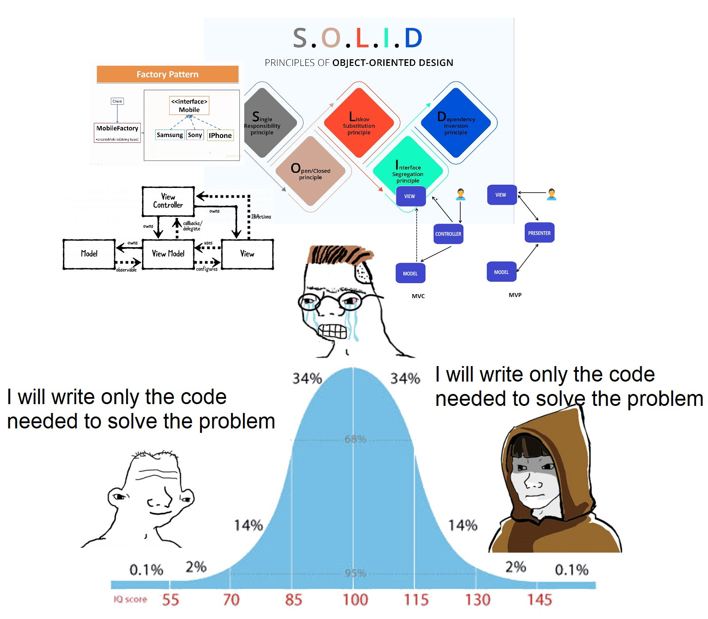

**History:**
- Liskov Substitution Principle and Open-Closed principles have been formulated in 1988
- In 2000s R. Martin selected those 5 principles as the most important OOP Principle
- Michael Feathers figured out the abbreviation

- Principles shouldn't leave much space for interpretation. SOLID does.
- Reducing good OO techniques to just 5 is absurd. And the S and I is the same.
- Has wrong naming ? Big YES “Single” in the S principle is the source of a plethora of confusion and rightly so. The naming was wrong
. “Inversion” in the D principle, also another source of confusion/misuse. Naming also wrong
- I'm in software craftsmanship; all of my code is CLEAN, SOLID, TDD, BDD, KISS, DRY, XP, OMG, and a total catastrophy.
- There’s LOTS of content on clean architecture and best practices and SOLID. Lots of enterprise influence…
- SOLID, CQRS, Whatever. This meme is just way too true. There is a misdirected pride in making things overly complex in many cases. Aim to keep things simple. and evolve from there if you have too.

- Developers can justify anything by saying it's "clean" 
- SOLID and Clean Architecture are the “Nobody ever got fired for buying IBM” of software design.

## Single-Responsibility Principle
- One of the most misinterpreted principle
> In short, it says that a subsystem, module, class, or even a function, should not have more than one reason to change.
> — _Robert C. Martin, 97 Things Every Programmer Should Know_

## Open-Closed Principle

## Liskov Substitution Principle

## Interface Segregation Principle

## Dependency Inversion

